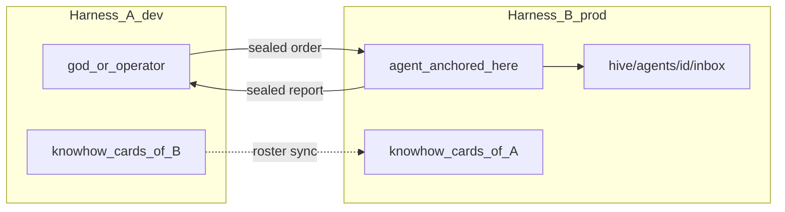

# Architecture Spine — Peer Harness Coop

Records **multi-harness cooperation** decisions on top of the additive sealed MQTT bridge. Rationale lives in `.memlog.md`. Does **not** reopen AD-9..AD-13.

## Paradigm

**Harness coop, machine-anchored agents:** each install keeps its own office on disk. Peers exchange **sealed mail** and **knowhow cards** (roster metadata) so offices can coordinate (e.g. dev laptop ↔ prod VPS). Agents never float off their machine: paths and files stay local; the remote UI shows presence + mail destination only.

```text
Harness A (UI)                     Harness B (UI or future headless)
  pair card ⇄ peers.json             pair card ⇄ peers.json
  roster publish ←→ MQTT roster ←→   roster publish
  god/operator sendRemote ──seal──→  …/agents/{id}/inbox → hive.send → disk → nudge
```



## Inherited invariants (read-only)

- AD-1 Dual planes — terminal vs hive event plane.
- AD-9..AD-13 Additive sealed MQTT bridge; inbound via `hive.send`; same-machine disk-only; merge-friendly; opaque relay.
- Entitlement: reuse existing `canNetwork` / Teams plan **as a technical gate only** — no Teams product work in this cycle.

## Architectural decisions

### AD-14 Agent machine-anchored [ADOPTED]

- **Binds:** An agent’s identity for addressing is `(deviceId, agentId)` where `agentId` is the on-disk block under `hive/agents/<agentId>/` (inbox/outbox/memory live only there) plus that install’s cwd. The governing LLM may be remote; **filesystem and paths are not shareable** across harnesses.
- **Prevents:** Treating one agent as jointly controllable from multiple installs; pretending VPS paths exist on a laptop (or the reverse); “take the wheel” of a remote agent’s tools/PTY as if local.
- **Rule:** Remote UI entries are proxies (mail targets + knowhow), never clones of another harness’s disk.

### AD-15 Harness coop, not hosted app [ADOPTED]

- **Binds:** Product value is connecting **2–3 harness instances** (LAN or dumb broker) for god↔god and operator→remote-agent mail. Optional later host: **opaque MQTT relay** and/or billing console — never the Electron office as multi-tenant agent runtime.
- **Prevents:** Designing “host the application” as the primary Teams/coop model; cloud multi-user control of the same unanchored agent.
- **Rule:** If a proposal moves agent execution or hive disk into a shared hosted app, reject and open a new spine.

### AD-16 Knowhow = capability cards only [ADOPTED]

- **Binds:** Peer knowhow sync publishes **agent cards**: `agentId`, `name`, `role`, `caps[]`, `isGod`, `deviceId`, `peerLabel` / env label. Only agents **marked for sync** on the Sync screen are published; only remote cards **accepted/followed** appear in the local representation. Refresh on pair, selection change, local spawn/archive (if still selected), or cheap periodic publish on `…/roster`.
- **Prevents:** Syncing `memory.md`, `identity.md`, inbox/outbox/`.done`, cwd, secrets, or repo trees as “shared knowhow.” Auto-publishing every local agent without operator choice.
- **Rule:** Rich context (runbooks, postmortems) travels as **one-off mail bodies**, not continuous disk replication.

### AD-17 Wire address mirrors delivery mailbox [ADOPTED]

- **Binds:** Delivery topic: `md/{lanNs}/dev/{deviceId}/agents/{agentId}/inbox` (relative mirror of `hive/agents/{agentId}/inbox`). Roster topic: `md/{lanNs}/dev/{deviceId}/roster`. Cycle-1 `lanNs` defaults to `local` (no Teams org/seat in the topic). Seal remains **per device**. After unseal, envelope `to` is authoritative for `hive.send`; topic/to mismatch → drop (or prefer envelope per implementation note in SPEC).
- **Prevents:** Absolute `harnessHome` / PII paths on the wire; remote topics for `outbox`, `.done`, `memory`, `identity`; treating MQTT topics as filesystem sync.
- **Rule:** Device-level `…/dev/{deviceId}/inbox` may remain as legacy; new coop traffic uses per-agent inbox topics.

### AD-18 Outbound remote mail is operator/god gated [ADOPTED]

- **Binds:** Cycle-1 remote send is initiated by **human operator or local god** via UI/IPC (`sendRemote`), not by automatic relay of every local worker outbox to the network.
- **Prevents:** Accidental cross-harness spam; workers inventing remote peers; collapsing AD-11 (same-machine) into always-MQTT.
- **Rule:** Wider auto-routing of outbox `to=` remote addresses needs a later spine decision.

### AD-19 Sync screen is the add-remote-harness workflow [ADOPTED]

- **Binds:** Cycle-1 primary UX for adding a remote harness is a **Sync screen** (Settings or dedicated panel) that shows:
  1. **This harness (boss) MQTT address card** — copy/share (`mqttUrl`, `deviceId`, pubs, `envLabel`).
  2. **Peer address field** — paste/import the other harness’s card.
  3. **Agent sync selection** — checklist of local agents to **publish** (share knowhow) and, once the peer roster is visible, checklist of remote agents to **follow** into the local representation (tint by `deviceId`).
  Followed remotes appear in list / Command Center with tint. Pair state → `network/peers.json` including per-peer sync selection.
- **Prevents:** Pairing as a hidden API-only step; requiring Pixi floor avatars for remotes in cycle-1; implying remote PTY/FS; syncing agents the operator did not mark.
- **Rule:** Floor avatars for remote peers are Deferred; must still obey AD-14 if added. God is selectable like any agent (default: include god in publish/follow unless unchecked).

## Deferred / rejected

| Item | Status | Why |
|------|--------|-----|
| Teams product (seats, console, hosted Teams UX, billing in-app) | **Deferred** | Out of needed scope; gate reuse only |
| Headless `munder serve` / agent-cli (opencode-serve analogue) | **Deferred** | Cycle-2; required for real VPS peer without UI |
| Hosted dumb MQTT broker (NAT) | **Deferred** | Cycle-2; LAN broker enough for cycle-1 |
| Pixi floor remote agent avatars | **Deferred** | Sync screen + list/CC + tint first |
| Auto-relay local worker outbox to remote peers | **Deferred** | AD-18; needs explicit later decision |
| Hosted Electron/office multi-tenant agent control | **Rejected** | AD-15; breaks machine-anchored model |
| Full hive filesystem / memory sync as knowhow | **Rejected** | AD-14/AD-16 |
| Remote wire destinations for outbox/memory/identity | **Rejected** | Delivery is inbox-only (AD-10/AD-17) |

## Next process step

SPEC cycle-1 lives at `_bmad-output/specs/spec-peer-harness-coop/` (includes Sync screen workflow). Implement only after SPEC acceptance on `feat/peer-harness-coop` — not on `dev` directly.
