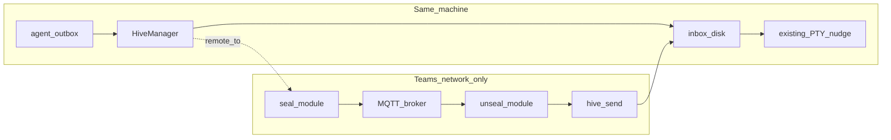

# Architecture diagrams

## Planes



## Entitlement gate

```text
canNetwork == false  →  no MQTT client; local deliver only
canNetwork == true   →  local deliver unchanged; remote path may seal+publish / subscribe+unseal+hive.send
```
