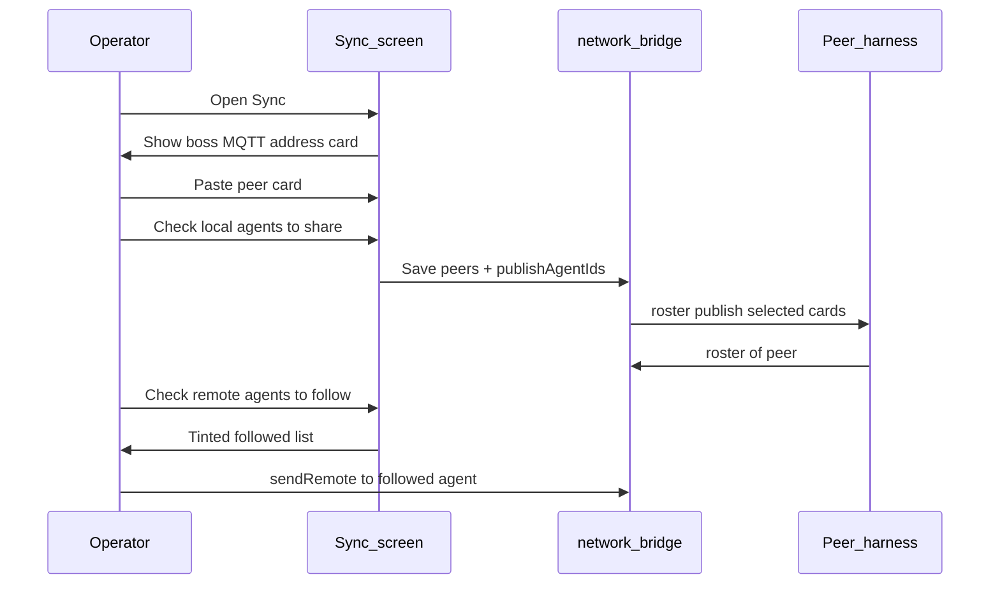
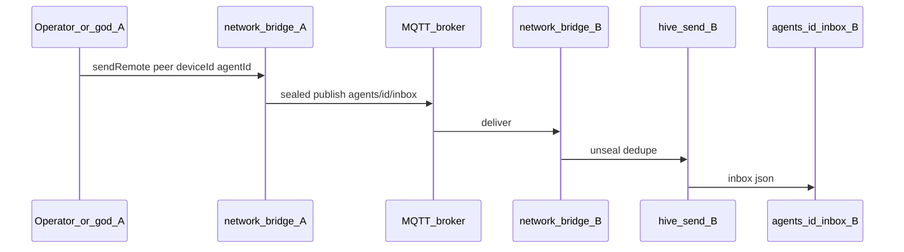
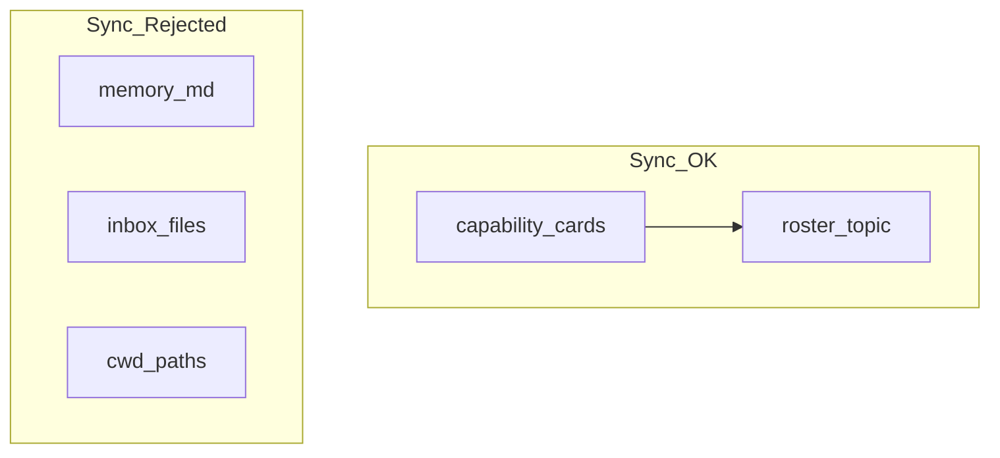

# Architecture diagrams

## Sync screen workflow

```mermaid
sequenceDiagram
  participant Op as Operator
  participant Sync as Sync_screen
  participant Net as network_bridge
  participant Peer as Peer_harness
  Op->>Sync: Open Sync
  Sync->>Op: Show boss MQTT address card
  Op->>Sync: Paste peer card
  Op->>Sync: Check local agents to share
  Sync->>Net: Save peers + publishAgentIds
  Net->>Peer: roster publish selected cards
  Peer->>Net: roster of peer
  Op->>Sync: Check remote agents to follow
  Sync->>Op: Tinted followed list
  Op->>Net: sendRemote to followed agent
```

## Coop mail path

```mermaid
sequenceDiagram
  participant Op as Operator_or_god_A
  participant NetA as network_bridge_A
  participant Br as MQTT_broker
  participant NetB as network_bridge_B
  participant HiveB as hive_send_B
  participant DiskB as agents_id_inbox_B
  Op->>NetA: sendRemote peer deviceId agentId
  NetA->>Br: sealed publish agents/id/inbox
  Br->>NetB: deliver
  NetB->>HiveB: unseal dedupe
  HiveB->>DiskB: inbox json
```

## Knowhow vs disk

```mermaid
flowchart TB
  subgraph syncOK [Sync_OK]
    Cards[capability_cards]
    Roster[roster_topic]
    Cards --> Roster
  end
  subgraph syncNO [Sync_Rejected]
    Mem[memory_md]
    Inbox[inbox_files]
    Cwd[cwd_paths]
  end
```
